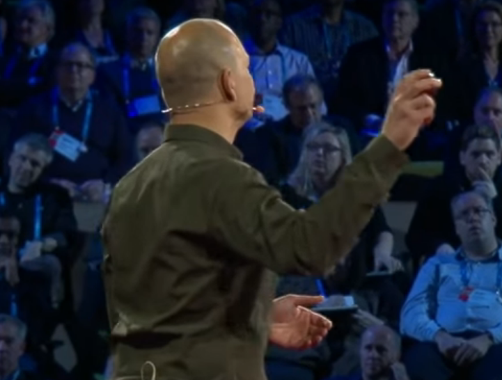
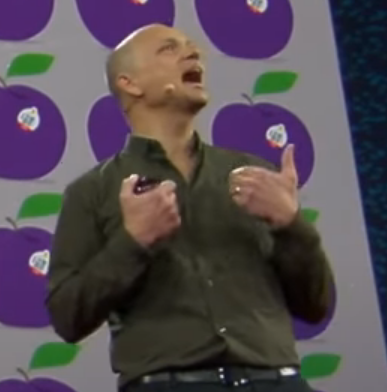
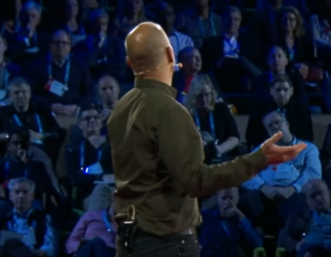

> Talks: [The first secret of great design | Tony Fadell](https://www.youtube.com/watch?v=9uOMectkCCs&ab_channel=TED)

## What's this talk about

If you take a step back and look at all the boxes. Maybe there's a way to remove one or combine them so you can make that process much simpler.

We see the world more clearly when we see it for the first time. Before a lifetime of habits got in the way, our challenge was to get back there to feel that frustration, to see those little details to look broader, closer, and to think younger.

## Body language

### Normal

Always feet shoulder-width apart. Hands above waist, or clenched and drooping naturally

Often putting a hand up. Like squeezing something. To highlight, or to show a pause.

### Emphasizing

I only list one of these times. Because they were added later

| Word/Expression                            | time           | Gesture                                                                                          | Image                                                                 |
| ------------------------------------------ | -------------- | ------------------------------------------------------------------------------------------------ | --------------------------------------------------------------------- |
| Something                                  | 1:33           | Hand up holding something.                                                                       |  |
| Word / Vocabulary Feeling / expression | 0:56           | Hands open in proper size.                                                                       |  |
| Showing something                          | 1:06           | A hand clearly showing something, a hand guiding to the direction.                               |  |
| Wanted                                     | 2:05           | Both fist side up.                                                                               |  |
| Me                                         | 2:19           | Thumb up ( or like a "C") rather than pointing himself.                                          |  |
| Action (cleaning)                          | 5:16           | Simple hand movement. **No** overly subtle movements where it is not important.                  |  |
| Back                                       | 1:14           | Hand naturally closed. Wave inward.                                                              |  |
| Ahhhhh! (Expressing)                       | 8:40           | clawing.                                                                                         |  |
| Tiny details                               | 3:42           | Finger opening a small range. Not totally closed. (Maybe because his finger is closed in normal) |  |
| Feel                                       | 15:44          | Sqeezing both hand in front of the waist.                                                        |   |
| That's it                                  | 14:47          | Hands wide open                                                                                  |   |
| Listing points                             | 9:53 15:51 | Thumb point front. Not counting. Or hands open                                                   |  |
| Thank you (Ending)                         | 16:35          | Raising fist.                                                                                    |  |
